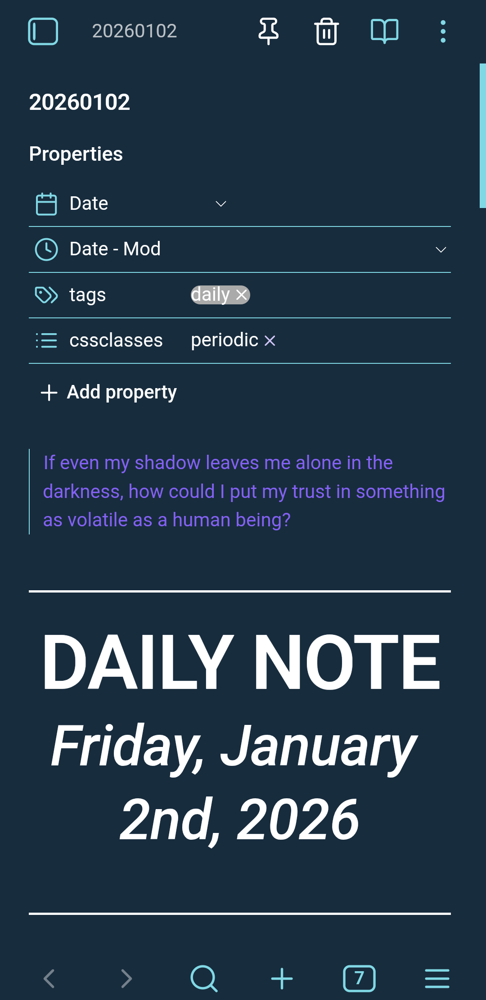
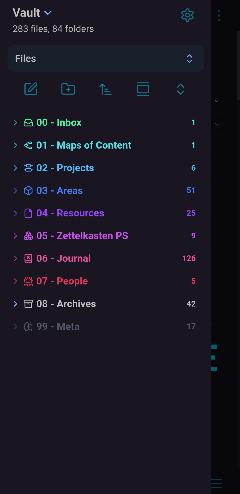
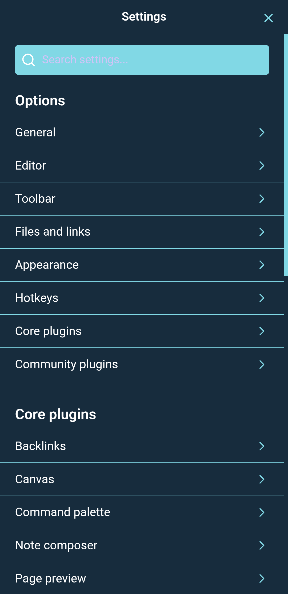

<h1 align="center">
  
<br>
WeightOS's Vault
<br>

<br>
"Weight builds foundation"
<br>

<div align="center">
<p></p>
<div align="center">
<a href="https://github.com/AntonAbbac/WeightOS/">
<a href="https://obsidian.md" target="_blank">

</a>

</a>
<a href="https://github.com/AntonAbbac/WeightOS/blob/main/LICENSE">

</a>
</div>
<br>
</div>
</h1>

# Function — 🧠 Second Brain
## 🌌 Overview

### 🖼️ Gallery

##### 📱 Mobile

<p align="center">


2025-12-22</b>

</p>

### 🔹 Layout

### 📖 Future Systems —

#### PARA System

#### Zettelkasten System

#### PS System Zettelkasten

#### Journaling System


|                          | 📖 Plugins                                                                                                                                                                                                                                                                                                                                                       |
| ------------------------ | :--------------------------------------------------------------------------------------------------------------------------------------------------------------------------------------------------------------------------------------------------------------------------------------------------------------------------------------------------------------- |
| **📓 Core Plugins**      | - Audio Recorder<br>- Backlinks<br>- Bases<br>- Bookmarks<br>- Canvas<br>- Command Palette<br>- Files<br>- Footnotes View<br>- Graph View<br>- Note Composer<br>- Outgoing Links<br>- Outline<br>- Page Preview<br>- Properties View<br>- Quick Switcher<br>- Search<br>- Slash Commands<br>- Slides<br>- Tags View<br>- Word Count<br>- Workspaces              |
| **📚 Community Plugins** | - Advanced Canvas<br>- Advanced Tables<br>- Calendar<br>- Code Styler<br>- Commander<br>- Dataview<br>- File Explorer Note Count<br>- Homepage<br>- Iconize<br>- Linter<br>- Ninja Cursor<br>- Omnisearch<br>- Paste URL into selection<br>- QuickAdd<br>- Style Settings<br>- Tag Wrangler<br>- Templater<br> - Various Complements<br>  |

### 🗂️ Folder Structure

    - 📁 00 - Inbox
    - 📁 01 - Maps of content
    - 📁 02 - Projects
    - 📁 03 - Areas
    - 📁 04 - Resources
    - 📁 05 - Zettelkasten PS
    	- 📁 00 - Fleeting IP
    	- 📁 01 - Permanent R
    	- 📁 02 - Literature Notes PS
    - 📁 06 - Journal
    	- 📁 00 - Daily Notes
    	- 📁 01 - Weekly Notes
    	- 📁 02 - Monthly Notes
    	- 📁 03 - Annual Notes
    - 📁 07 - Archives
    	- 📁 Attatchments
    - 📁 08 - AI
      - 📁 ChatGPT
        - 📁 Prompts
    - 📁 99 - Meta
    	- 📁 00 - Templates
    	- 📁 01 - Vault Systems
    	- 📁 02 - Flowcharts

# 🔧 Installation

> [!CAUTION]
> Before installing and using the vault system, try to understand how its systems and information cycle works to minimize questions and find answers.
> I am not responsible for any installation or configuration difficulties.

> [!NOTE]
> It is highly recommended to understand how the vault works before using it.

#### 1. **Install Obsidian**

First, install Obsidian for your specific device.(Windows; Linux; MacOS; Android; etc)

> [!NOTE]
> Official URL: https://obsidian.md/download

#### 2. **Clone the repo**

```bash
nix-shell -p git
https://github.com/AntonAbbac/WeightOS
cd WeightOS
```

> [!NOTE]
> It is essential that git is already installed on your device to continue.

#### 3. **Open the Vault**

Open the WeightOS folder in obsidian and ability the comunnity plugins to start the vault system and enjoy! 😺

## 👥 Credits

This is a solo project, created for initial and advanced markdown/obsidian users.

My efforts is alone, but with a lot of focus.

## 📃 License

This project is licensed under the **MIT License** - see the [LICENSE](./LICENSE) file for details.

        /\
       /  \
      / ▢ \  ≈ Weight.
     /------\
    |  |  |  |
    |________|
